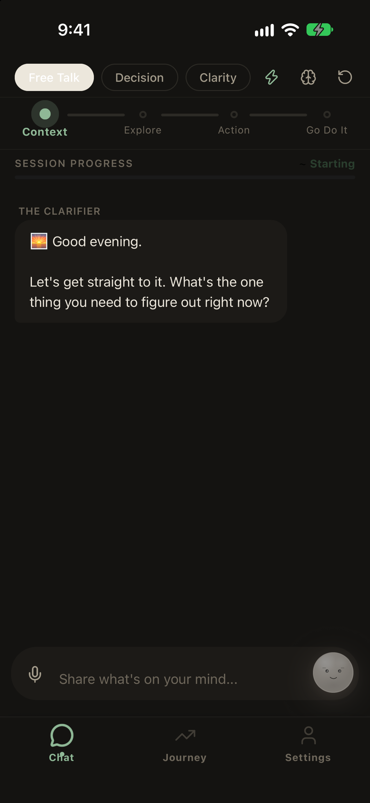
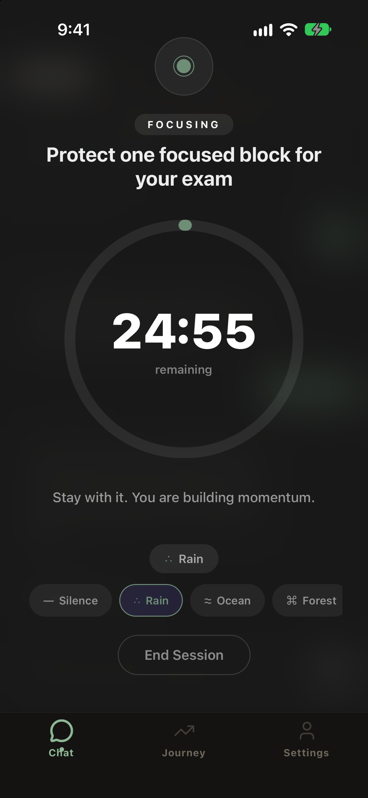
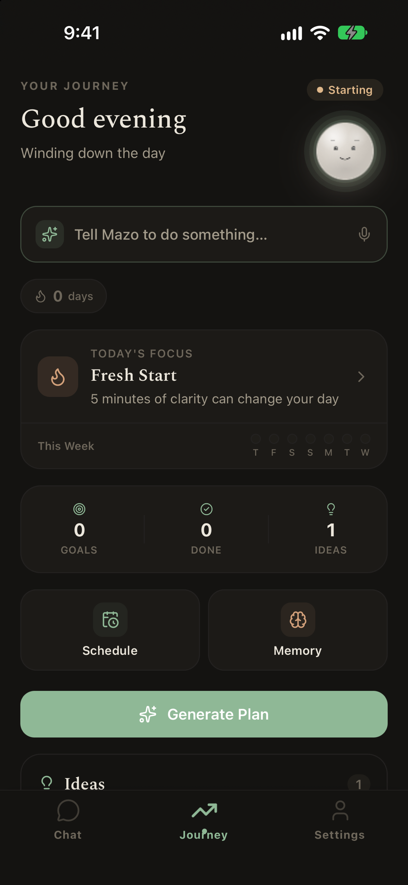

# Mazō

### From overwhelm to one real step.

Mazō is a personalized coaching app for the moment between *knowing what matters* and *actually starting*. Instead of leaving someone in an endless conversation, it helps them clarify the problem, choose a manageable action, approve any device changes, begin a focus block, and return to the plan if they drift.

Built by **Omar Aloush**, an undergraduate student at Zewail City, for the RevenueCat Shipaton 2026 Next Gen category.

<p align="center">
  
  &nbsp;&nbsp;
  
  &nbsp;&nbsp;
  
</p>

## The idea

Imagine a student with an exam on Friday who keeps opening Instagram instead of studying. A generic chatbot may offer advice; a blocking app may remove a distraction. Mazō connects the two sides of that moment: a coach helps the student identify one specific study block, asks them to approve useful actions, and leaves a next step they can find again after the chat closes.

**Clarify → choose → approve → focus → check in → return.**

This is the product's central design constraint: the conversation should lead *out of the app and into action*.

## What Mazō does

- **Coaching with a destination.** Decision, Clarity, Planning, and Reflection modes guide different kinds of conversations through phases. The app supports a library of coaches, custom coach instructions, and a configurable Mazō character, so the tone and visual presence can fit the person using it.
- **Approval before action.** The assistant can propose a plan, but the user reviews it before Mazō saves a note, sets an in-app alarm or reminder, adds a calendar event, starts Android app guarding, or hands off to another app. Action receipts show what actually succeeded.
- **A real next step.** A conversation can end with a specific task saved to Journey. Mind preserves useful notes and insights; Journey brings tasks, alarms, and progress back into view.
- **Focus and recovery.** A focus timer supports the first work block. If the session ends early, Mazō asks what happened and can help the user restart with a smaller step instead of treating the interruption as failure.
- **Android Focus Guardian.** On a permissioned Android development build, a native foreground service detects when a selected distracting app comes to the foreground and places a full-screen focus wall over it for the approved session. A separate configurable nudge can respond to prolonged use of watched apps and offer a route back to Mazō. See [how the Android guard works](#android-focus-guardian).
- **RevenueCat subscriptions.** The native app integrates `react-native-purchases` for offerings, purchases, restores, and entitlement updates. The web implementation is a UI simulator, not a live store purchase flow.

## What is real on each platform?

| Capability | Android development build | iOS development build | Web preview |
| --- | --- | --- | --- |
| Coaching, coaches, Journey, Mind, focus timer | Yes | Yes | Yes |
| Approved notes and in-app alarms | Yes | Yes | Preview/local behavior |
| Native Focus Guardian over selected third-party apps | **Yes, with permissions** | No | No |
| Focus Shield presentation | Yes | Preview + timer | Preview only |
| RevenueCat native purchases and restores | SDK integration | SDK integration | Simulated UI only |

The iPhone demo shows a **Focus Shield preview and Mazō's timer**, not iOS-wide blocking. An in-app alarm uses Mazō notifications; it is not an alarm in Apple's Clock app. Native store purchases require configured RevenueCat products and a sandbox/device test. This distinction matters when reproducing the demo.

## Android Focus Guardian

The Android implementation is source code in [`modules/mazo-focus-guard`](modules/mazo-focus-guard). It uses `UsageStatsManager` to observe the foreground package and a foreground service with `WindowManager.TYPE_APPLICATION_OVERLAY` to cover a user-selected app during an active focus session. The wall disappears when the user leaves that app or the session ends. It is an overlay-based focus intervention—not a system-level ban, and it does not uninstall or alter the other app.

The user must explicitly grant **Usage access** and **Display over other apps**. The native module is unavailable in Expo Go, iOS, and web. The same Android bridge also exposes installed-app lookup and on-device usage statistics for contextual coaching; these features require the relevant Android permission.

## How it is built

| Layer | Implementation |
| --- | --- |
| App | Expo SDK 54, React Native, TypeScript, Expo Router |
| Coaching | Structured modes and coach-specific guidance; provider-backed responses via a Supabase Edge Function when configured |
| Actions | Typed action proposals, explicit approval, ordered dispatch, and per-action receipts |
| Local state | AsyncStorage-backed profile, preferences, and app data |
| Android intervention | Local Expo native module written in Kotlin; foreground service, usage events, and overlays |
| Subscriptions | RevenueCat React Native SDK on native platforms; entitlement and restore handling |

The OpenAI credential belongs only in the server-side Edge Function environment. It is not embedded in the app. See [`supabase/functions/ai-chat`](supabase/functions/ai-chat) and the sample [`.env.example`](.env.example).

## Run it

Use Node.js 20+, npm, and a recent Expo-compatible native toolchain for iOS or Android.

```sh
git clone https://github.com/omar-aloush/mazo-app.git
cd mazo-app
npm install
npm run start-web
```

Expo prints the local web URL. For a self-contained walkthrough without AI credits, open `/chat?demo=1` in that web app. This **local demo mode uses scripted coaching replies**, while approved local actions such as saving a note and starting the timer still execute in the app. It is useful for testing the journey, but it is not a live-AI benchmark.

To use provider-backed coaching, copy [`.env.example`](.env.example) to `.env.local`, configure the public Supabase URL and anon key, deploy `supabase/functions/ai-chat`, and provide its OpenAI credential as a **server-side secret**. Do not place an OpenAI secret in an `EXPO_PUBLIC_` variable or commit it.

For native development, configure Android Studio or Xcode and run `npm run android` or `npm run ios`. Android Focus Guardian requires the resulting **development build**, followed by its two permission grants. Native subscriptions additionally require RevenueCat public SDK keys, configured products/entitlement, and sandbox testing. The project ID belongs in the Shipaton submission; it is not a private API secret.

## Verification

```sh
npx tsc --noEmit
npm run lint
```

For Android Guardian, verify the permission prompts, selected-app wall, exit behavior, and nudge on an actual Android device or suitable emulator. For payments, verify offerings, a sandbox purchase, entitlement changes, and restore on the target native platform. A web preview cannot validate either native feature.

## Project map

- [`app/`](app) — screens and navigation
- [`components/`](components) — coaching, focus, and action UI
- [`constants/`](constants) — modes, coach definitions, and action metadata
- [`services/`](services) — action dispatch, AI client, alarms, and platform integrations
- [`providers/`](providers) — app state, memory, and subscription state
- [`modules/mazo-focus-guard/`](modules/mazo-focus-guard) — Android native Focus Guardian
- [`supabase/functions/`](supabase/functions) — server-side AI and subscription support functions

## License

MIT © 2026 Omar Aloush. See [LICENSE](LICENSE).
